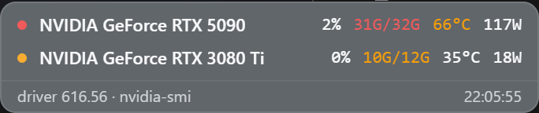

# dsh-gpu-pulse

A floating GPU monitor inside the DSH Web UI. Live per-GPU **utilization, VRAM, temperature and power**, plus the top VRAM-consuming processes when the driver reports them, rendered as a compact, draggable strip (one row per GPU) in the DeepSeek Harness page.

Works on any machine with an NVIDIA driver (Windows or Linux): the data comes from `nvidia-smi`, so multi-GPU rigs show one instrument block per GPU. `nvidia-smi` only reports discrete NVIDIA adapters, so integrated GPUs (Intel UHD, AMD iGPU, ...) are never part of the display. No extra service to run and no agent tools to call: the card polls the DSH host's own route.

**Note:** the plugin is NVIDIA-only (nvidia-smi backend). On machines without an NVIDIA driver it degrades to a small `GPU n/a` pill and re-probes every 5 minutes, so it lights up on its own once a driver is installed.

## Screenshot



The strip stays on top of side panels and side cards (for example the `dsh-better-sidebar` Files panel) instead of being covered by them.

## Positioning

The strip starts at the bottom-right corner and is **draggable**: press and drag it anywhere on the page. The position is remembered (persisted per browser profile), so it stays where you left it across new sessions and reboots. Double-click the strip to reset it to the default corner.

## Install

```sh
# from GitHub
dsh plugin --profile web add github:zhubaohi/dsh-gpu-pulse

# or from a local clone
dsh plugin --profile web add /path/to/dsh-gpu-pulse
```

The npm name `dsh-gpu-pulse` is reserved: `dsh plugin --profile web add dsh-gpu-pulse` will work once the npm package is published.

Then restart `dsh web`. The strip appears at the bottom-right corner of the GUI; drag it wherever you like and the spot is remembered.

## What you see

One row per GPU, intentionally compact (about 85 px for two GPUs):

- **status dot**: green / amber / red by the worst of the row's thresholds
- **name**: the exact GPU name as reported by the driver (hover for the GPU index and fan speed)
- **GPU**: utilization (green below 60%, amber 60-85%, red at 85% and above)
- **VRAM**: used/total GiB (green below 75%, amber 75-90%, red at 90% and above)
- **TEMP**: temperature (green below 65 °C, amber 65-80 °C, red at 80 °C and above)
- **PWR**: power draw (whole watts below 1 kW)
- **TOP PROCESSES**: the biggest VRAM consumers, when the driver attributes memory per process (most recent Windows drivers report `[N/A]` for graphics contexts, in which case this section is omitted)
- footer: driver (KMD) version + timestamp of the last sample

The exact GPU name (as reported by the driver) is shown in every row.

## Configuration

Everything is optional: defaults work out of the box. Override in the profile's `cordis.patch.yml` (an id-targeted patch replaces the whole config, so restate every field you want to keep):

```yaml
- id: dsh-gpu-pulse
  config:
    pollMs: 3000            # client poll interval hint, default 2000, floor 500
    showProcesses: true     # also collect per-process VRAM consumers
    nvidiaSmiPath: 'C:\Windows\System32\nvidia-smi.exe'  # default: "nvidia-smi" via PATH
```

`pollMs` is a *hint* served to the client in every status response, so it applies to all open tabs without a browser-side setting.

## How it works

- **Host** (`index.js`): registers `GET /dsh-gpu-pulse/status` on the DSH host web server. Each request runs up to four `nvidia-smi` queries (`--query-gpu` metrics, `--query-gpu=index,name`, `--version`, and optionally `--query-compute-apps`) with a 4 s timeout, parses the CSV, and returns JSON. Results are cached for ~1.2 s so several open tabs share one process per poll cycle.
- **Client** (`client/client.js`): a hand-written `__ModuleLoader__` bundle (no build step, the only require is the platform `react` seed) that mounts the widget into the `shell.overlay` slot. It polls the status route, styles itself with the active theme's `--dsw-*` token variables (static fallbacks keep older hosts readable), and handles its own pointer events for dragging (the position is stored in `localStorage` under a `dsh-gpu-pulse:pos` key). Because side-panel plugins stack above the overlay slot's default z-index, the client promotes the overlay layer to the top of the app's stack at runtime, so side cards and drawers can never cover the widget.

## Requirements

- Node ≥ 18, `dsh web` 0.1.0-rc.6+ (the `shell.overlay` slot)
- An NVIDIA driver with `nvidia-smi` on `PATH` (Windows or Linux)
- No runtime dependencies beyond Node builtins

## License

MIT, see [LICENSE](LICENSE). `nvidia-smi` is a NVIDIA Corporation tool, invoked read-only.